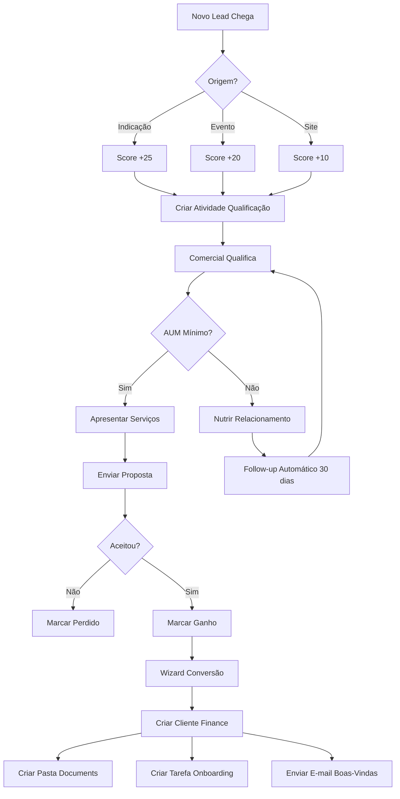

# Finance CRM Integration - Arquitetura Completa

## 📋 Índice
1. [Visão Geral](#visão-geral)
2. [Por que Integrar CRM?](#por-que-integrar-crm)
3. [Estrutura do Módulo](#estrutura-do-módulo)
4. [Funcionalidades Core](#funcionalidades-core)
5. [Modelos e Campos](#modelos-e-campos)
6. [Workflows e Automações](#workflows-e-automações)
7. [Integração com Finance Core](#integração-com-finance-core)
8. [Relatórios e Analytics](#relatórios-e-analytics)
9. [Regras de Segurança](#regras-de-segurança)
10. [Implementação Passo a Passo](#implementação-passo-a-passo)

---

## 🎯 Visão Geral

O módulo **Finance CRM Integration** conecta o CRM nativo do Odoo com o ecossistema Finance, permitindo:

- **Gestão de Leads**: Captação e qualificação de potenciais clientes de investimentos
- **Pipeline de Conversão**: Lead → Oportunidade → Cliente Finance
- **Scoring Automático**: Classificação de leads por AUM potencial e perfil
- **Automação de Follow-ups**: Campanhas, e-mails, tarefas e lembretes
- **Funil de Vendas**: Visualização do pipeline de captação
- **Integração Total**: Quando lead vira cliente, automaticamente cria registro Finance

---

## 🎯 Por que Integrar CRM?

### Priorização como 2º ou 3º Módulo

| Critério | Justificativa |
|----------|---------------|
| **Crescimento de Base** | Consultoria precisa captar novos clientes constantemente |
| **Automação de Vendas** | Reduz trabalho manual do time comercial |
| **Rastreabilidade** | Todo histórico do lead desde primeiro contato |
| **Conversão Qualificada** | Só converte leads qualificados com AUM mínimo |
| **ROI de Marketing** | Métricas claras de origem de leads e conversão |

### Quando Implementar?

- **Opção A (2º módulo)**: Se prioridade é crescimento de base
- **Opção B (3º módulo)**: Após Compliance, se prioridade é regulatório

---

## 📁 Estrutura do Módulo

```
finance_crm/
│
├── __init__.py
├── __manifest__.py
├── README.md
│
├── models/
│   ├── __init__.py
│   ├── crm_lead.py                    # Extensão do modelo crm.lead
│   ├── crm_stage.py                   # Extensão de crm.stage
│   ├── crm_team.py                    # Times de vendas especializados
│   ├── finance_lead_source.py         # Origem dos leads (campanha, indicação, evento)
│   ├── finance_lead_scoring.py        # Regras de scoring
│   ├── finance_conversion_history.py  # Histórico de conversões
│   └── res_partner.py                 # Link com Finance Core
│
├── security/
│   ├── crm_security.xml              # Grupos de acesso
│   └── ir.model.access.csv           # Permissões de modelos
│
├── views/
│   ├── crm_lead_views.xml            # Formulários e listas de leads
│   ├── crm_stage_views.xml           # Configuração de estágios
│   ├── crm_team_views.xml            # Times de captação
│   ├── finance_lead_source_views.xml # Origens de leads
│   ├── crm_dashboard.xml             # Dashboard de vendas
│   └── crm_menu.xml                  # Menus integrados
│
├── data/
│   ├── crm_stages_data.xml           # Estágios padrão do funil
│   ├── crm_teams_data.xml            # Times padrão
│   ├── lead_sources_data.xml         # Origens padrão
│   ├── scoring_rules_data.xml        # Regras de pontuação
│   └── crm_cron.xml                  # Jobs agendados (scoring, follow-up)
│
├── wizard/
│   ├── __init__.py
│   ├── crm_convert_to_client_wizard.py       # Conversão Lead → Cliente
│   ├── crm_convert_to_client_wizard_views.xml
│   ├── crm_mass_mailing_wizard.py            # Envio de campanhas
│   └── crm_mass_mailing_wizard_views.xml
│
└── reports/
    ├── crm_conversion_report.py      # Relatório de conversão
    ├── crm_pipeline_report.py        # Análise de pipeline
    └── crm_report_templates.xml      # Templates PDF
```

---

## ⚙️ Funcionalidades Core

### 1. **Gestão de Leads Finance**

```python
# Campos específicos para leads financeiros
- expected_aum: Float (AUM esperado)
- investment_profile: Selection (Conservador, Moderado, Agressivo)
- lead_temperature: Selection (Cold, Warm, Hot)
- lead_score: Integer (0-100, calculado automaticamente)
- finance_source_id: Many2one (Origem do lead)
- can_convert_to_client: Boolean (computed)
- min_aum_reached: Boolean (computed)
```

### 2. **Pipeline Finance Personalizado**

**Estágios Padrão:**
1. 🆕 **Novo Lead** - Primeiro contato
2. 🔍 **Qualificação** - Validação de perfil e AUM
3. 📞 **Contato Inicial** - Primeira reunião agendada
4. 📊 **Apresentação** - Apresentação de serviços
5. 📝 **Proposta** - Proposta comercial enviada
6. ✅ **Ganho** - Convertido em cliente
7. ❌ **Perdido** - Não converteu

### 3. **Scoring Automático de Leads**

**Critérios de Pontuação (0-100 pontos):**

| Critério | Pontos |
|----------|--------|
| **AUM Esperado** | |
| > R$ 1.000.000 | 30 pontos |
| R$ 500.000 - R$ 1.000.000 | 20 pontos |
| R$ 100.000 - R$ 500.000 | 10 pontos |
| < R$ 100.000 | 5 pontos |
| **Origem do Lead** | |
| Indicação de cliente | 25 pontos |
| Evento presencial | 20 pontos |
| LinkedIn/Rede social | 15 pontos |
| Site/Formulário | 10 pontos |
| Cold call | 5 pontos |
| **Temperatura** | |
| Hot (pronto para investir) | 25 pontos |
| Warm (interesse médio) | 15 pontos |
| Cold (apenas pesquisando) | 5 pontos |
| **Perfil Profissional** | |
| Empresário/CEO | 15 pontos |
| Executivo C-Level | 12 pontos |
| Profissional Liberal | 8 pontos |
| Outros | 5 pontos |
| **Engajamento** | |
| Respondeu follow-up | 5 pontos |
| Abriu e-mail | 3 pontos |
| Visitou site | 2 pontos |

**Classificação:**
- 🔥 **Hot Lead** (80-100 pontos): Prioridade máxima
- 🌡️ **Warm Lead** (50-79 pontos): Bom potencial
- ❄️ **Cold Lead** (0-49 pontos): Nutrir relacionamento

### 4. **Conversão Automática Lead → Cliente**

**Wizard de Conversão:**
```python
def action_convert_to_finance_client(self):
    """
    Converte Lead em Cliente Finance
    
    Validações:
    - AUM mínimo atingido (configurável, default R$ 50.000)
    - Dados cadastrais completos (CPF, endereço, contato)
    - Aceite de termos (LGPD)
    
    Ações Automáticas:
    1. Cria res.partner com is_finance_client=True
    2. Cria finance_profile_id
    3. Cria finance.lifecycle (estado: lead)
    4. Cria pasta no Documents
    5. Atribui advisor_id
    6. Marca CRM Lead como "Ganho"
    7. Cria atividade "Iniciar Onboarding"
    """
```

### 5. **Automações de Follow-up**

**Ações Automáticas por Estágio:**

| Estágio | Automação |
|---------|-----------|
| **Novo Lead** | ✉️ E-mail de boas-vindas + Material institucional |
| **Qualificação** | 📅 Criar tarefa "Ligar para qualificar" (2 dias) |
| **Contato Inicial** | 📆 Agendar reunião + Enviar calendário |
| **Apresentação** | 📤 Enviar apresentação institucional |
| **Proposta** | ⏰ Lembrete follow-up (7 dias) |
| **Sem Atividade (14 dias)** | 🔔 Alerta ao comercial |
| **Sem Atividade (30 dias)** | ❄️ Mudar temperatura para "Cold" |

---

## 📊 Modelos e Campos

### 1. **crm_lead.py** (Extensão)

```python
# -*- coding: utf-8 -*-

from odoo import models, fields, api, _
from odoo.exceptions import ValidationError

class CrmLead(models.Model):
    _inherit = 'crm.lead'

    # =====================================
    # CAMPOS FINANCE
    # =====================================
    
    # Identificação Finance
    is_finance_lead = fields.Boolean(
        string='Lead Financeiro',
        default=True,
        help='Marca este lead como relacionado a serviços financeiros'
    )
    
    finance_lead_id = fields.Char(
        string='ID Lead Finance',
        readonly=True,
        copy=False,
        help='Identificador único do lead financeiro'
    )
    
    # Informações Financeiras
    expected_aum = fields.Monetary(
        string='AUM Esperado',
        currency_field='company_currency',
        tracking=True,
        help='Valor estimado de ativos sob gestão'
    )
    
    investment_profile = fields.Selection([
        ('conservative', 'Conservador'),
        ('moderate', 'Moderado'),
        ('aggressive', 'Agressivo'),
        ('unknown', 'Desconhecido')
    ], string='Perfil de Investimento',
       default='unknown',
       tracking=True)
    
    # Scoring e Qualificação
    lead_score = fields.Integer(
        string='Score do Lead',
        compute='_compute_lead_score',
        store=True,
        help='Pontuação automática de 0-100 baseada em critérios'
    )
    
    lead_temperature = fields.Selection([
        ('cold', 'Cold'),
        ('warm', 'Warm'),
        ('hot', 'Hot')
    ], string='Temperatura',
       compute='_compute_lead_temperature',
       store=True,
       tracking=True)
    
    # Origem e Rastreamento
    finance_source_id = fields.Many2one(
        'finance.lead.source',
        string='Origem Finance',
        tracking=True
    )
    
    referrer_partner_id = fields.Many2one(
        'res.partner',
        string='Indicado por',
        domain=[('is_finance_client', '=', True)],
        help='Cliente que indicou este lead'
    )
    
    # Conversão
    min_aum_reached = fields.Boolean(
        string='AUM Mínimo Atingido',
        compute='_compute_min_aum_reached',
        store=True
    )
    
    can_convert_to_client = fields.Boolean(
        string='Pode Converter',
        compute='_compute_can_convert_to_client',
        help='Verifica se lead está pronto para conversão'
    )
    
    finance_client_id = fields.Many2one(
        'res.partner',
        string='Cliente Finance Criado',
        readonly=True,
        help='Cliente criado após conversão'
    )
    
    # Dados Profissionais
    professional_profile = fields.Selection([
        ('entrepreneur', 'Empresário/CEO'),
        ('c_level', 'Executivo C-Level'),
        ('professional', 'Profissional Liberal'),
        ('employee', 'CLT'),
        ('retired', 'Aposentado'),
        ('other', 'Outro')
    ], string='Perfil Profissional')
    
    company_revenue = fields.Monetary(
        string='Faturamento Empresa',
        currency_field='company_currency',
        help='Faturamento anual da empresa (se empresário)'
    )
    
    # Engajamento
    last_engagement_date = fields.Datetime(
        string='Último Engajamento',
        compute='_compute_last_engagement_date',
        store=True
    )
    
    engagement_score = fields.Integer(
        string='Score Engajamento',
        compute='_compute_engagement_score',
        store=True,
        help='Pontuação baseada em interações (e-mails, calls, reuniões)'
    )
    
    # =====================================
    # COMPUTED FIELDS
    # =====================================
    
    @api.depends('expected_aum')
    def _compute_min_aum_reached(self):
        """Verifica se AUM mínimo foi atingido"""
        min_aum = float(self.env['ir.config_parameter'].sudo().get_param(
            'finance_crm.min_aum_conversion', default=50000.00
        ))
        
        for lead in self:
            lead.min_aum_reached = lead.expected_aum >= min_aum
    
    @api.depends('expected_aum', 'finance_source_id', 'lead_temperature', 
                 'professional_profile', 'engagement_score')
    def _compute_lead_score(self):
        """Calcula score automático do lead (0-100)"""
        for lead in self:
            score = 0
            
            # Pontos por AUM (0-30 pontos)
            if lead.expected_aum >= 1000000:
                score += 30
            elif lead.expected_aum >= 500000:
                score += 20
            elif lead.expected_aum >= 100000:
                score += 10
            elif lead.expected_aum >= 50000:
                score += 5
            
            # Pontos por origem (0-25 pontos)
            if lead.finance_source_id:
                score += lead.finance_source_id.score_points or 0
            
            # Pontos por temperatura (0-25 pontos)
            temp_scores = {'hot': 25, 'warm': 15, 'cold': 5}
            score += temp_scores.get(lead.lead_temperature, 0)
            
            # Pontos por perfil profissional (0-15 pontos)
            profile_scores = {
                'entrepreneur': 15,
                'c_level': 12,
                'professional': 8,
                'employee': 5,
                'retired': 6,
                'other': 3
            }
            score += profile_scores.get(lead.professional_profile, 0)
            
            # Pontos por engajamento (0-5 pontos)
            score += min(lead.engagement_score, 5)
            
            lead.lead_score = min(score, 100)
    
    @api.depends('lead_score')
    def _compute_lead_temperature(self):
        """Define temperatura baseada no score"""
        for lead in self:
            if lead.lead_score >= 80:
                lead.lead_temperature = 'hot'
            elif lead.lead_score >= 50:
                lead.lead_temperature = 'warm'
            else:
                lead.lead_temperature = 'cold'
    
    @api.depends('activity_ids.date_deadline')
    def _compute_last_engagement_date(self):
        """Data da última atividade/interação"""
        for lead in self:
            last_activity = lead.activity_ids.sorted('date_deadline', reverse=True)[:1]
            lead.last_engagement_date = last_activity.date_deadline if last_activity else False
    
    @api.depends('activity_ids', 'message_ids')
    def _compute_engagement_score(self):
        """Score de engajamento baseado em interações"""
        for lead in self:
            score = 0
            # +1 ponto por atividade completada
            score += len(lead.activity_ids.filtered(lambda a: a.state == 'done'))
            # +0.5 ponto por e-mail enviado/recebido
            score += len(lead.message_ids.filtered(lambda m: m.message_type == 'email')) * 0.5
            lead.engagement_score = int(score)
    
    @api.depends('min_aum_reached', 'partner_name', 'email_from', 'phone', 'stage_id')
    def _compute_can_convert_to_client(self):
        """Verifica se lead pode ser convertido em cliente"""
        for lead in self:
            lead.can_convert_to_client = all([
                lead.min_aum_reached,
                lead.partner_name,
                lead.email_from or lead.phone,
                lead.stage_id.is_won,  # Deve estar em estágio "Ganho"
                not lead.finance_client_id  # Ainda não convertido
            ])
    
    # =====================================
    # CRUD OVERRIDES
    # =====================================
    
    @api.model_create_multi
    def create(self, vals_list):
        """Gera finance_lead_id ao criar"""
        for vals in vals_list:
            if vals.get('is_finance_lead', True) and not vals.get('finance_lead_id'):
                vals['finance_lead_id'] = self._generate_finance_lead_id()
        
        leads = super().create(vals_list)
        
        # Automação: Criar atividade de qualificação
        for lead in leads.filtered('is_finance_lead'):
            lead._create_qualification_activity()
        
        return leads
    
    def write(self, vals):
        """Track mudanças importantes"""
        result = super().write(vals)
        
        # Se mudou para "Ganho" e pode converter, sugerir conversão
        if vals.get('stage_id'):
            for lead in self.filtered('can_convert_to_client'):
                lead._suggest_conversion()
        
        return result
    
    # =====================================
    # ACTIONS
    # =====================================
    
    def action_convert_to_finance_client(self):
        """Abre wizard de conversão para cliente Finance"""
        self.ensure_one()
        
        if not self.can_convert_to_client:
            raise ValidationError(_(
                'Este lead não está pronto para conversão. Verifique:\n'
                '- AUM mínimo atingido\n'
                '- Dados cadastrais completos\n'
                '- Lead marcado como "Ganho"'
            ))
        
        return {
            'name': _('Converter para Cliente Finance'),
            'type': 'ir.actions.act_window',
            'res_model': 'crm.convert.to.client.wizard',
            'view_mode': 'form',
            'target': 'new',
            'context': {
                'default_lead_id': self.id,
                'default_expected_aum': self.expected_aum,
                'default_investment_profile': self.investment_profile,
            }
        }
    
    def action_view_finance_client(self):
        """Visualiza cliente Finance criado"""
        self.ensure_one()
        
        if not self.finance_client_id:
            return
        
        return {
            'name': _('Cliente Finance'),
            'type': 'ir.actions.act_window',
            'res_model': 'res.partner',
            'res_id': self.finance_client_id.id,
            'view_mode': 'form',
            'target': 'current',
        }
    
    # =====================================
    # HELPERS
    # =====================================
    
    def _generate_finance_lead_id(self):
        """Gera ID único do lead financeiro"""
        sequence = self.env['ir.sequence'].next_by_code('finance.crm.lead') or 'LEAD-0001'
        return sequence
    
    def _create_qualification_activity(self):
        """Cria atividade de qualificação para novos leads"""
        self.ensure_one()
        
        activity_type = self.env.ref('mail.mail_activity_data_call', raise_if_not_found=False)
        
        if activity_type:
            self.activity_schedule(
                activity_type_id=activity_type.id,
                summary='Qualificar Lead Finance',
                note=f'Qualificar lead com AUM esperado de {self.expected_aum:,.2f}',
                user_id=self.user_id.id or self.env.uid,
                date_deadline=fields.Date.today() + timedelta(days=2)
            )
    
    def _suggest_conversion(self):
        """Notifica usuário sobre possibilidade de conversão"""
        self.ensure_one()
        
        self.message_post(
            body=_(
                '<p>🎉 <strong>Este lead está pronto para conversão!</strong></p>'
                '<p>Clique em "Converter para Cliente Finance" para iniciar o processo.</p>'
            ),
            subject='Lead pronto para conversão',
            message_type='notification',
        )
    
    # =====================================
    # CRON JOBS
    # =====================================
    
    @api.model
    def _cron_update_cold_leads(self):
        """
        Job agendado: Atualiza leads sem atividade para "Cold"
        Roda diariamente
        """
        threshold_date = fields.Datetime.now() - timedelta(days=30)
        
        cold_leads = self.search([
            ('is_finance_lead', '=', True),
            ('lead_temperature', '!=', 'cold'),
            ('last_engagement_date', '<', threshold_date),
            ('active', '=', True),
        ])
        
        for lead in cold_leads:
            lead.write({'lead_temperature': 'cold'})
            lead.message_post(
                body=_('Lead marcado como Cold por inatividade (30+ dias sem engajamento)'),
                subject='Temperatura atualizada',
            )
    
    @api.model
    def _cron_remind_follow_ups(self):
        """
        Job agendado: Lembra comerciais de fazer follow-up
        Roda diariamente
        """
        threshold_date = fields.Date.today() - timedelta(days=7)
        
        leads_needing_followup = self.search([
            ('is_finance_lead', '=', True),
            ('stage_id.is_won', '=', False),
            ('last_engagement_date', '<', threshold_date),
            ('active', '=', True),
            ('user_id', '!=', False),
        ])
        
        for lead in leads_needing_followup:
            # Criar atividade de follow-up
            lead.activity_schedule(
                activity_type_id=self.env.ref('mail.mail_activity_data_call').id,
                summary='Follow-up Lead Finance',
                note=f'Lead sem contato há mais de 7 dias. Score atual: {lead.lead_score}',
                user_id=lead.user_id.id,
            )
```

### 2. **finance_lead_source.py**

```python
# -*- coding: utf-8 -*-

from odoo import models, fields

class FinanceLeadSource(models.Model):
    _name = 'finance.lead.source'
    _description = 'Origem de Leads Financeiros'
    _order = 'score_points desc, name'

    name = fields.Char(
        string='Nome da Origem',
        required=True,
        help='Ex: Indicação Cliente, LinkedIn, Evento XP'
    )
    
    code = fields.Char(
        string='Código',
        help='Código único para rastreamento'
    )
    
    source_type = fields.Selection([
        ('referral', 'Indicação'),
        ('event', 'Evento'),
        ('social', 'Rede Social'),
        ('website', 'Site'),
        ('cold_call', 'Cold Call'),
        ('partner', 'Parceiro'),
        ('advertising', 'Publicidade'),
        ('other', 'Outro')
    ], string='Tipo de Origem', required=True)
    
    score_points = fields.Integer(
        string='Pontos no Score',
        default=10,
        help='Pontos adicionados ao lead score (0-25)'
    )
    
    active = fields.Boolean(default=True)
    
    lead_count = fields.Integer(
        string='Total de Leads',
        compute='_compute_lead_count'
    )
    
    conversion_rate = fields.Float(
        string='Taxa de Conversão (%)',
        compute='_compute_conversion_rate',
        help='% de leads desta origem que viraram clientes'
    )
    
    description = fields.Text(string='Descrição')
    
    def _compute_lead_count(self):
        for source in self:
            source.lead_count = self.env['crm.lead'].search_count([
                ('finance_source_id', '=', source.id)
            ])
    
    def _compute_conversion_rate(self):
        for source in self:
            total_leads = self.env['crm.lead'].search_count([
                ('finance_source_id', '=', source.id)
            ])
            
            converted_leads = self.env['crm.lead'].search_count([
                ('finance_source_id', '=', source.id),
                ('finance_client_id', '!=', False)
            ])
            
            source.conversion_rate = (converted_leads / total_leads * 100) if total_leads > 0 else 0.0
```

### 3. **crm_convert_to_client_wizard.py**

```python
# -*- coding: utf-8 -*-

from odoo import models, fields, api, _
from odoo.exceptions import ValidationError

class CrmConvertToClientWizard(models.TransientModel):
    _name = 'crm.convert.to.client.wizard'
    _description = 'Wizard: Converter Lead em Cliente Finance'

    lead_id = fields.Many2one('crm.lead', string='Lead', required=True)
    
    # Dados básicos
    partner_name = fields.Char(string='Nome Completo', required=True)
    vat = fields.Char(string='CPF/CNPJ')
    email = fields.Char(string='E-mail', required=True)
    phone = fields.Char(string='Telefone', required=True)
    mobile = fields.Char(string='Celular')
    
    # Endereço
    street = fields.Char(string='Logradouro')
    street2 = fields.Char(string='Complemento')
    city = fields.Char(string='Cidade')
    state_id = fields.Many2one('res.country.state', string='Estado')
    zip = fields.Char(string='CEP')
    country_id = fields.Many2one('res.country', string='País', default=lambda self: self.env.ref('base.br'))
    
    # Informações Finance
    expected_aum = fields.Monetary(string='AUM Inicial', currency_field='currency_id')
    currency_id = fields.Many2one('res.currency', default=lambda self: self.env.company.currency_id)
    investment_profile = fields.Selection([
        ('conservative', 'Conservador'),
        ('moderate', 'Moderado'),
        ('aggressive', 'Agressivo')
    ], string='Perfil de Investimento')
    
    advisor_id = fields.Many2one('res.users', string='Advisor Responsável', required=True)
    
    # LGPD
    lgpd_consent = fields.Boolean(
        string='Aceite LGPD',
        help='Cliente autorizou tratamento de dados pessoais'
    )
    
    # Flags
    create_onboarding_task = fields.Boolean(
        string='Criar Tarefa de Onboarding',
        default=True
    )
    
    send_welcome_email = fields.Boolean(
        string='Enviar E-mail de Boas-Vindas',
        default=True
    )
    
    @api.onchange('lead_id')
    def _onchange_lead_id(self):
        """Preenche dados do lead"""
        if self.lead_id:
            self.partner_name = self.lead_id.partner_name or self.lead_id.contact_name
            self.email = self.lead_id.email_from
            self.phone = self.lead_id.phone
            self.mobile = self.lead_id.mobile
            self.street = self.lead_id.street
            self.street2 = self.lead_id.street2
            self.city = self.lead_id.city
            self.state_id = self.lead_id.state_id
            self.zip = self.lead_id.zip
            self.country_id = self.lead_id.country_id
            self.expected_aum = self.lead_id.expected_aum
            self.investment_profile = self.lead_id.investment_profile
            self.advisor_id = self.lead_id.user_id
    
    def action_convert(self):
        """Executa conversão do lead em cliente Finance"""
        self.ensure_one()
        
        # Validações
        if not self.lgpd_consent:
            raise ValidationError(_('É necessário o aceite LGPD para criar o cliente.'))
        
        if not self.lead_id.can_convert_to_client:
            raise ValidationError(_('Este lead não pode ser convertido. Verifique os requisitos.'))
        
        # 1. Criar res.partner como cliente Finance
        partner_vals = {
            'name': self.partner_name,
            'vat': self.vat,
            'email': self.email,
            'phone': self.phone,
            'mobile': self.mobile,
            'street': self.street,
            'street2': self.street2,
            'city': self.city,
            'state_id': self.state_id.id,
            'zip': self.zip,
            'country_id': self.country_id.id,
            'is_finance_client': True,
            'finance_lifecycle_state': 'lead',
            'advisor_id': self.advisor_id.id,
            'comment': f'Convertido do Lead CRM: {self.lead_id.finance_lead_id}',
        }
        
        partner = self.env['res.partner'].create(partner_vals)
        
        # 2. Criar patrimônio inicial (se AUM > 0)
        if self.expected_aum > 0:
            self.env['finance.patrimony'].create({
                'partner_id': partner.id,
                'aum': self.expected_aum,
                'snapshot_date': fields.Date.today(),
                'snapshot_type': 'initial',
                'notes': 'AUM inicial declarado na conversão do lead',
            })
        
        # 3. Atualizar CRM Lead
        self.lead_id.write({
            'finance_client_id': partner.id,
            'active': False,  # Arquiva o lead
        })
        
        # Marcar como ganho se ainda não estiver
        if not self.lead_id.stage_id.is_won:
            won_stage = self.env['crm.stage'].search([
                ('is_won', '=', True),
                ('team_id', '=', self.lead_id.team_id.id)
            ], limit=1)
            if won_stage:
                self.lead_id.stage_id = won_stage
        
        # 4. Criar atividade de onboarding
        if self.create_onboarding_task:
            partner.activity_schedule(
                activity_type_id=self.env.ref('mail.mail_activity_data_todo').id,
                summary='Iniciar Onboarding do Cliente',
                note=f'Novo cliente convertido do lead {self.lead_id.finance_lead_id}\n'
                     f'AUM inicial: {self.expected_aum:,.2f}\n'
                     f'Perfil: {dict(self.investment_profile_selection())[self.investment_profile]}',
                user_id=self.advisor_id.id,
                date_deadline=fields.Date.today() + timedelta(days=3)
            )
        
        # 5. Enviar e-mail de boas-vindas
        if self.send_welcome_email:
            template = self.env.ref('finance_crm.email_template_welcome_client', raise_if_not_found=False)
            if template:
                template.send_mail(partner.id, force_send=True)
        
        # 6. Registrar conversão no histórico
        self.env['finance.conversion.history'].create({
            'lead_id': self.lead_id.id,
            'partner_id': partner.id,
            'conversion_date': fields.Datetime.now(),
            'converted_by_id': self.env.uid,
            'initial_aum': self.expected_aum,
            'lead_score_at_conversion': self.lead_id.lead_score,
            'days_to_convert': (fields.Date.today() - self.lead_id.create_date.date()).days,
        })
        
        # 7. Abrir form do novo cliente
        return {
            'name': _('Cliente Finance Criado'),
            'type': 'ir.actions.act_window',
            'res_model': 'res.partner',
            'res_id': partner.id,
            'view_mode': 'form',
            'target': 'current',
        }
    
    @api.model
    def investment_profile_selection(self):
        """Retorna opções de perfil de investimento"""
        return self.env['crm.lead']._fields['investment_profile'].selection
```

---

## 🔄 Workflows e Automações

### Fluxo Completo: Lead → Cliente



### Automações de E-mail

| Trigger | E-mail |
|---------|--------|
| Novo lead criado | Boas-vindas + Material institucional |
| Lead em "Qualificação" | Pedido de agendamento de call |
| Lead em "Proposta" | Envio da proposta comercial |
| Sem atividade (7 dias) | Lembrete de follow-up ao comercial |
| Lead convertido | E-mail de boas-vindas como cliente |

---

## 🔗 Integração com Finance Core

### Sincronização Automática

Quando um **Lead CRM vira Cliente Finance**:

```python
# O que acontece automaticamente:

1. res.partner criado com:
   - is_finance_client = True
   - finance_profile_id = AUTO_GERADO
   - finance_lifecycle_state = 'lead'
   - advisor_id = comercial do lead

2. finance.lifecycle criado:
   - Estado inicial: 'lead'
   - Data: data da conversão
   - Origem: 'CRM Lead {finance_lead_id}'

3. finance.patrimony criado:
   - AUM inicial = expected_aum do lead
   - snapshot_type = 'initial'

4. Pasta Documents criada:
   - Clients/[CPF] - [Nome]/
   - Subpastas: 01. Cadastro, 02. Compliance, 03. Contratos...

5. Atividade criada:
   - Tipo: Onboarding
   - Responsável: advisor_id
   - Prazo: 3 dias
```

### Rastreamento Bidirecional

- **Lead → Cliente**: Campo `finance_client_id` no Lead
- **Cliente → Lead**: Campo `crm_lead_id` no Partner (opcional)
- **Histórico completo** salvo em `finance.conversion.history`

---

## 📈 Relatórios e Analytics

### 1. **Dashboard CRM Finance**

**KPIs Principais:**
- 📊 Total de Leads Ativos
- 🎯 Taxa de Conversão Geral
- 💰 AUM Total em Pipeline
- 🔥 Leads Hot (score 80+)
- ⏱️ Tempo Médio de Conversão
- 👥 Leads por Advisor

### 2. **Relatório de Conversão**

```sql
-- Análise de conversão por origem
SELECT 
    fs.name AS origem,
    COUNT(cl.id) AS total_leads,
    COUNT(cl.finance_client_id) AS convertidos,
    ROUND(COUNT(cl.finance_client_id)::numeric / COUNT(cl.id) * 100, 2) AS taxa_conversao,
    AVG(cl.lead_score) AS score_medio,
    SUM(cl.expected_aum) AS aum_pipeline
FROM crm_lead cl
LEFT JOIN finance_lead_source fs ON cl.finance_source_id = fs.id
WHERE cl.is_finance_lead = TRUE
GROUP BY fs.name
ORDER BY taxa_conversao DESC;
```

### 3. **Análise de Pipeline**

- AUM por estágio do funil
- Velocidade de movimentação entre estágios
- Taxa de perda por estágio
- Performance por advisor

---

## 🔐 Regras de Segurança

### Grupos de Acesso

```xml
<!-- security/crm_security.xml -->

<record id="group_finance_sales_user" model="res.groups">
    <field name="name">Finance Sales User</field>
    <field name="category_id" ref="base.module_category_sales_sales"/>
    <field name="implied_ids" eval="[(4, ref('sales_team.group_sale_salesman'))]"/>
</record>

<record id="group_finance_sales_manager" model="res.groups">
    <field name="name">Finance Sales Manager</field>
    <field name="category_id" ref="base.module_category_sales_sales"/>
    <field name="implied_ids" eval="[(4, ref('group_finance_sales_user'))]"/>
</record>
```

### Regras de Registro (Record Rules)

```xml
<!-- Vendedor vê apenas seus leads -->
<record id="crm_lead_finance_user_rule" model="ir.rule">
    <field name="name">Finance Leads: User Own Leads</field>
    <field name="model_id" ref="crm.model_crm_lead"/>
    <field name="domain_force">[('user_id', '=', user.id), ('is_finance_lead', '=', True)]</field>
    <field name="groups" eval="[(4, ref('group_finance_sales_user'))]"/>
</record>

<!-- Manager vê todos os leads finance -->
<record id="crm_lead_finance_manager_rule" model="ir.rule">
    <field name="name">Finance Leads: Manager All Leads</field>
    <field name="model_id" ref="crm.model_crm_lead"/>
    <field name="domain_force">[('is_finance_lead', '=', True)]</field>
    <field name="groups" eval="[(4, ref('group_finance_sales_manager'))]"/>
</record>
```

---

## 🚀 Implementação Passo a Passo

### Fase 1: Setup Básico (Semana 1)
- [ ] Criar estrutura de pastas do módulo
- [ ] Configurar `__manifest__.py` com dependências
- [ ] Criar grupos de segurança
- [ ] Implementar `crm_lead.py` com campos finance
- [ ] Criar `finance_lead_source.py`

### Fase 2: Scoring e Automações (Semana 2)
- [ ] Implementar lógica de scoring automático
- [ ] Criar cron jobs (cold leads, follow-ups)
- [ ] Configurar automações de e-mail
- [ ] Criar estágios personalizados do pipeline

### Fase 3: Wizard de Conversão (Semana 3)
- [ ] Implementar `crm_convert_to_client_wizard.py`
- [ ] Criar views do wizard
- [ ] Integrar com Finance Core (criar partner, lifecycle, patrimony)
- [ ] Integrar com Documents (criar pasta automática)

### Fase 4: Views e UX (Semana 4)
- [ ] Criar formulário extendido de Lead
- [ ] Implementar dashboard CRM Finance
- [ ] Criar relatórios de conversão
- [ ] Smart buttons (ver cliente criado, histórico)

### Fase 5: Testes e Refinamento (Semana 5)
- [ ] Testes de conversão completa
- [ ] Validar automações de e-mail
- [ ] Testar record rules e permissões
- [ ] Ajustes de UX baseados em feedback

### Fase 6: Dados Iniciais (Semana 6)
- [ ] Carregar origens de leads padrão
- [ ] Configurar estágios do funil
- [ ] Criar templates de e-mail
- [ ] Documentação de uso

---

## 📋 Checklist de Funcionalidades

### MVP (Mínimo Viável)
- [x] Extensão de `crm.lead` com campos finance
- [x] Scoring automático de leads
- [x] Origens de leads configuráveis
- [x] Wizard de conversão Lead → Cliente
- [x] Integração com Finance Core
- [x] Integração com Documents (pasta automática)

### V2 (Incrementos)
- [ ] Dashboard avançado com gráficos
- [ ] Automações de e-mail por estágio
- [ ] Integração com campanhas de e-mail marketing
- [ ] Relatórios detalhados de conversão
- [ ] Previsão de AUM por pipeline

### V3 (Avançado)
- [ ] IA para previsão de conversão
- [ ] Chatbot para qualificação inicial
- [ ] Integração com WhatsApp Business
- [ ] Lead scoring preditivo com ML
- [ ] Análise de sentimento em interações

---

## 🎯 Métricas de Sucesso

| Métrica | Meta | Como Medir |
|---------|------|------------|
| Taxa de Conversão | > 15% | Leads ganhos / Total de leads |
| Tempo de Conversão | < 30 dias | Média de dias entre criação e conversão |
| AUM Médio Convertido | > R$ 500k | Média de `expected_aum` dos convertidos |
| Engajamento | > 5 interações | Média de `engagement_score` |
| Lead Score Médio | > 60 pontos | Média de `lead_score` dos leads ativos |

---

## 🔧 Configurações Recomendadas

### Parâmetros do Sistema

```python
# ir.config_parameter

finance_crm.min_aum_conversion = 50000.00  # AUM mínimo para conversão
finance_crm.cold_lead_threshold_days = 30  # Dias sem atividade = cold
finance_crm.followup_reminder_days = 7     # Dias para lembrete follow-up
finance_crm.auto_qualify_hot_leads = True  # Qualificar leads hot automaticamente
```

---

## 📚 Dependências do Módulo

```python
# __manifest__.py

'depends': [
    'crm',                  # CRM nativo Odoo
    'sales_team',           # Times de vendas
    'finance_core',         # Finance Core (SSOT)
    'documents',            # Gestão documental
    'mail',                 # Sistema de mensagens
],
```

---

## ✅ Próximos Passos

Após implementar **Finance CRM Integration**, você terá:

✅ Pipeline completo de captação de clientes  
✅ Conversão automatizada Lead → Cliente Finance  
✅ Scoring inteligente de leads  
✅ Rastreamento de origem e ROI de marketing  
✅ Integração total com Finance Core e Documents  

**Próximo Módulo Sugerido:**
- **Finance Investments** (Produtos, posições, ordens)
- **Finance Billing & Fees** (Cobrança de taxas de administração)

---

## 📞 Suporte e Documentação

- 📖 Documentação CRM Odoo: https://www.odoo.com/documentation/17.0/applications/sales/crm.html
- 🎓 Odoo Academy CRM: https://www.odoo.com/slides/crm-20
- 💬 Fórum Odoo: https://www.odoo.com/forum

---

**Versão:** 1.0  
**Última Atualização:** 2025  
**Autor:** Arquitetura Finance System  
**Status:** 📘 Especificação Completa
