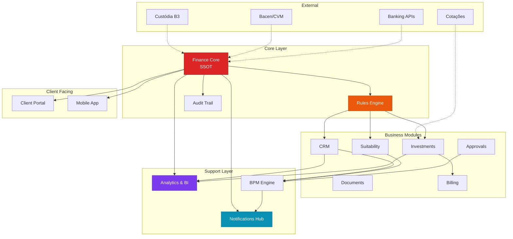

# 🏗️ Finance Core - Arquitetura Completa para Odoo

## 📘 Visão Geral do Projeto

Sistema de consultoria de investimentos dividido em 5 módulos principais, com o **Finance Core** sendo a fundação (SSOT - Single Source of Truth) para dados financeiros, suitability, ciclo de vida, compliance e preferências consolidadas do cliente.

---

## 🧩 Arquitetura Geral do Sistema



---

## 📊 Módulos do Sistema

### 1. Finance Core (SSOT)
- **Função**: Núcleo central com dados mestres de clientes
- **Responsabilidades**:
  - Profile consolidado do cliente
  - Lifecycle stages (Lead → Prospect → Active → VIP → Churn)
  - AUM (Assets Under Management)
  - Compliance básico (KYC, PEP)
  - Categorização e segmentação

### 2. Finance CRM Integration
- Integração com módulo CRM nativo do Odoo
- Lead scoring e conversão automática
- Pipeline de vendas para produtos financeiros

### 3. Finance Compliance & Suitability
- Questionários de suitability dinâmicos
- Cálculo de perfil de risco
- Histórico de adequação
- Alertas de renovação

### 4. Finance Investments
- Catálogo de produtos de investimento
- Posições consolidadas por cliente
- Transações (aplicações, resgates)
- Integração com custodiantes
- Cálculo de performance

### 5. Finance Documents
- Gestão documental com OCR
- Contratos e termos
- Integração com assinatura digital
- Versionamento e auditoria

### 6. Finance Billing & Fees
- Cálculo automático de taxas (management, performance, entry)
- Faturamento recorrente
- Integração com contabilidade (account.move)

### 7. Finance Portal
- Portal do cliente (self-service)
- Visualização de posições
- Relatórios e extratos
- Área de documentos

### 8. Finance Analytics
- Dashboards executivos
- Análise de funil
- Performance de advisors
- Previsões e trends

---

## 🎯 Diretrizes de Adaptação para Odoo

### Filosofia de Desenvolvimento

#### ✅ APROVEITE O CORE DO ODOO

**Módulos Nativos Úteis:**
- `account` → Contabilidade (plano de contas, diário, reconciliação)
- `crm` → CRM (leads, oportunidades, pipeline)
- `documents` → Gestão documental (pastas, tags, OCR, workflows)
- `res.partner` → Contatos (clientes, empresas, hierarquia)
- `portal` → Portal do cliente (acesso externo seguro)
- `sign` → Assinaturas eletrônicas (e-signature nativo)
- `approvals` → Workflows de aprovação

#### 🚫 NÃO REINVENTE A RODA
- Use herança de modelos (`_inherit`) em vez de criar tudo do zero
- Extend fields e views existentes
- Aproveite computed fields e related fields

---

## 📂 Estrutura Finance Core

```
finance_core/
├── __init__.py                      # Entry point do módulo
├── __manifest__.py                  # Metadados e dependências
├── models/                          # Camada de Dados
│   ├── __init__.py
│   ├── res_partner.py              # Extensão do cliente (SSOT)
│   ├── finance_lifecycle.py        # Histórico de estados
│   ├── finance_patrimony.py        # Histórico de patrimônio
│   ├── finance_category.py         # Categorização customizada
│   └── finance_config_settings.py  # Configurações do sistema
├── security/                        # Camada de Segurança
│   ├── ir.model.access.csv         # Permissões CRUD por grupo
│   └── finance_security.xml        # Grupos e Record Rules
├── views/                           # Camada de Apresentação
│   ├── res_partner_views.xml       # Interface do cliente
│   ├── finance_lifecycle_views.xml # Views de lifecycle
│   ├── finance_patrimony_views.xml # Views de patrimônio
│   ├── finance_dashboard.xml       # Dashboard executivo
│   └── finance_menu.xml            # Estrutura de menus
├── data/                            # Dados Iniciais
│   ├── finance_data.xml            # Seed data (categorias, etc)
│   └── finance_cron.xml            # Tarefas agendadas
├── wizard/                          # Assistentes Interativos
│   ├── __init__.py
│   └── finance_lifecycle_wizard.py # Mudança de stage com motivo
└── static/                          # Assets Estáticos
    ├── description/
    │   ├── icon.png                # Ícone do módulo
    │   └── index.html              # Descrição no App Store
    └── src/
        ├── css/
        │   └── finance_core.css    # Estilos customizados
        └── js/
            └── finance_dashboard.js # Lógica de dashboard
```

---

## 🔍 Detalhamento de Cada Arquivo

### 1. `__init__.py` (Raiz)

**Função:** Entry point do Python, registra subpacotes

```python
# finance_core/__init__.py
from . import models
from . import wizard
```

**Por quê?** Python precisa saber que `finance_core/` é um package e quais subpackages carregar.

---

### 2. `__manifest__.py` - Carteira de Identidade

**Função:** Define metadados, dependências e ordem de carregamento

```python
{
    'name': 'Finance Core',
    'version': '17.0.1.0.0',
    'category': 'Finance',
    'summary': 'Core module for investment advisory',
    'description': """
        Single Source of Truth (SSOT) for financial data.
        - Client profiles and lifecycle
        - AUM calculation and consolidation
        - Base for all finance modules
    """,
    'author': 'Your Company',
    'website': 'https://www.yourcompany.com',
    'license': 'LGPL-3',
    'depends': [
        'base',
        'contacts',
        'mail',           # Chatter e notificações
        'web',            # Interface web
    ],
    'data': [
        # Security (sempre primeiro)
        'security/finance_security.xml',
        'security/ir.model.access.csv',
        
        # Data
        'data/finance_data.xml',
        'data/finance_cron.xml',
        
        # Views
        'views/res_partner_views.xml',
        'views/finance_lifecycle_views.xml',
        'views/finance_patrimony_views.xml',
        'views/finance_dashboard.xml',
        'views/finance_menu.xml',
        
        # Wizards
        'wizard/finance_report_wizard_views.xml',
    ],
    'demo': [],
    'assets': {
        'web.assets_backend': [
            'finance_core/static/src/css/finance_core.css',
            'finance_core/static/src/js/finance_dashboard.js',
        ],
    },
    'installable': True,
    'application': True,
    'auto_install': False,
}
```

**Ordem Crítica:**
```
Security → Data → Views → Wizards → Reports
```

---

### 3. `models/__init__.py` - Registro de Models

```python
# finance_core/models/__init__.py
from . import res_partner
from . import finance_lifecycle
from . import finance_patrimony
from . import finance_category
from . import finance_config_settings
```

**Ordem importa?** Sim! Se `finance_lifecycle` tem foreign key para `res_partner`, carregue `res_partner` primeiro.

---

### 4. `models/res_partner.py` - SSOT

**Função:** Estende o modelo de parceiro com campos financeiros

```python
from odoo import models, fields, api, _
from odoo.exceptions import ValidationError
from datetime import datetime, timedelta
import logging

_logger = logging.getLogger(__name__)

class ResPartner(models.Model):
    _inherit = 'res.partner'
    
    # ================================
    # FIELDS - Identificação Financeira
    # ================================
    finance_profile_id = fields.Char(
        string='Finance Profile ID',
        copy=False,
        index=True,
        help='Unique identifier for finance operations'
    )
    
    is_finance_client = fields.Boolean(
        string='Finance Client',
        default=False,
        help='Check if this partner is a finance client'
    )
    
    # ================================
    # FIELDS - Lifecycle
    # ================================
    finance_lifecycle_state = fields.Selection([
        ('lead', 'Lead'),
        ('prospect', 'Prospect'),
        ('onboarding', 'Onboarding'),
        ('active', 'Active'),
        ('vip', 'VIP'),
        ('churning', 'Churning'),
        ('churned', 'Churned'),
        ('blocked', 'Blocked'),
    ], string='Lifecycle Stage', default='lead', tracking=True)
    
    finance_lifecycle_ids = fields.One2many(
        'finance.lifecycle',
        'partner_id',
        string='Lifecycle History'
    )
    
    lifecycle_changed_date = fields.Datetime(
        string='Last Stage Change',
        readonly=True
    )
    
    # ================================
    # FIELDS - Patrimônio (AUM)
    # ================================
    aum = fields.Monetary(
        string='AUM (Assets Under Management)',
        compute='_compute_aum',
        store=True,
        currency_field='currency_id',
        help='Total assets under management'
    )
    
    aum_updated_at = fields.Datetime(
        string='AUM Last Update',
        readonly=True
    )
    
    finance_patrimony_ids = fields.One2many(
        'finance.patrimony',
        'partner_id',
        string='Patrimony Details'
    )
    
    # ================================
    # FIELDS - Categorização
    # ================================
    finance_category_ids = fields.Many2many(
        'finance.category',
        'partner_finance_category_rel',
        'partner_id',
        'category_id',
        string='Finance Categories'
    )
    
    client_segment = fields.Selection([
        ('retail', 'Retail'),
        ('affluent', 'Affluent'),
        ('high_net_worth', 'High Net Worth'),
        ('ultra_high_net_worth', 'Ultra High Net Worth'),
    ], compute='_compute_client_segment', store=True)
    
    # ================================
    # FIELDS - Compliance (Básico)
    # ================================
    kyc_status = fields.Selection([
        ('pending', 'Pending'),
        ('in_progress', 'In Progress'),
        ('completed', 'Completed'),
        ('expired', 'Expired'),
        ('rejected', 'Rejected'),
    ], string='KYC Status', default='pending', tracking=True)
    
    kyc_completed_date = fields.Date('KYC Completed Date')
    kyc_expiry_date = fields.Date('KYC Expiry Date')
    
    is_pep = fields.Boolean(
        string='PEP (Politically Exposed Person)',
        tracking=True
    )
    
    risk_profile = fields.Selection([
        ('conservative', 'Conservative'),
        ('moderate', 'Moderate'),
        ('aggressive', 'Aggressive'),
        ('not_defined', 'Not Defined'),
    ], string='Risk Profile', default='not_defined')
    
    # ================================
    # FIELDS - Relacionamentos
    # ================================
    advisor_id = fields.Many2one(
        'res.users',
        string='Finance Advisor',
        tracking=True,
    )
    
    advisor_team_id = fields.Many2one(
        'crm.team',
        string='Advisory Team',
        domain=[('use_opportunities', '=', True)]
    )
    
    # ================================
    # FIELDS - Contabilidade
    # ================================
    finance_invoice_count = fields.Integer(
        compute='_compute_finance_invoice_count'
    )
    
    # ================================
    # FIELDS - Técnicos
    # ================================
    finance_notes = fields.Html('Finance Notes')
    
    finance_tag_ids = fields.Many2many(
        'res.partner.category',
        column1='partner_id',
        column2='category_id',
        string='Finance Tags'
    )
    
    # ================================
    # COMPUTE METHODS
    # ================================
    @api.depends('finance_patrimony_ids', 'finance_patrimony_ids.total_value')
    def _compute_aum(self):
        """Calcula AUM baseado nas posições consolidadas"""
        for partner in self:
            if partner.finance_patrimony_ids:
                partner.aum = sum(
                    patrimony.total_value 
                    for patrimony in partner.finance_patrimony_ids
                )
                partner.aum_updated_at = fields.Datetime.now()
            else:
                partner.aum = 0.0
                
    @api.depends('aum')
    def _compute_client_segment(self):
        """Segmentação automática baseada em AUM"""
        # Buscar thresholds das configurações
        ICP = self.env['ir.config_parameter'].sudo()
        retail_max = float(ICP.get_param('finance_core.retail_max', '100000'))
        affluent_max = float(ICP.get_param('finance_core.affluent_max', '1000000'))
        hnw_max = float(ICP.get_param('finance_core.hnw_max', '10000000'))
        
        for partner in self:
            if partner.aum < retail_max:
                partner.client_segment = 'retail'
            elif partner.aum < affluent_max:
                partner.client_segment = 'affluent'
            elif partner.aum < hnw_max:
                partner.client_segment = 'high_net_worth'
            else:
                partner.client_segment = 'ultra_high_net_worth'
                
    def _compute_finance_invoice_count(self):
        """Conta invoices relacionados a serviços financeiros"""
        Invoice = self.env['account.move']
        for partner in self:
            partner.finance_invoice_count = Invoice.search_count([
                ('partner_id', 'child_of', partner.id),
                ('move_type', 'in', ['out_invoice', 'out_refund']),
                ('state', '!=', 'cancel'),
            ])
    
    # ================================
    # ONCHANGE METHODS
    # ================================
    @api.onchange('is_finance_client')
    def _onchange_is_finance_client(self):
        """Auto-preenche dados ao marcar como cliente financeiro"""
        if self.is_finance_client and not self.finance_profile_id:
            self.finance_profile_id = self._generate_profile_id()
            
    # ================================
    # CONSTRAINT METHODS
    # ================================
    @api.constrains('finance_profile_id')
    def _check_finance_profile_id_unique(self):
        """Garante unicidade do Profile ID"""
        for partner in self:
            if partner.finance_profile_id:
                duplicate = self.search([
                    ('finance_profile_id', '=', partner.finance_profile_id),
                    ('id', '!=', partner.id)
                ], limit=1)
                if duplicate:
                    raise ValidationError(_(
                        'Finance Profile ID must be unique. '
                        'ID %s already exists for %s'
                    ) % (partner.finance_profile_id, duplicate.name))
    
    @api.constrains('kyc_expiry_date', 'kyc_completed_date')
    def _check_kyc_dates(self):
        """Valida datas de KYC"""
        for partner in self:
            if partner.kyc_completed_date and partner.kyc_expiry_date:
                if partner.kyc_expiry_date <= partner.kyc_completed_date:
                    raise ValidationError(_(
                        'KYC Expiry Date must be after Completed Date'
                    ))
    
    # ================================
    # CRUD METHODS
    # ================================
    @api.model_create_multi
    def create(self, vals_list):
        """Override create para gerar Profile ID automático"""
        for vals in vals_list:
            if vals.get('is_finance_client') and not vals.get('finance_profile_id'):
                vals['finance_profile_id'] = self._generate_profile_id()
        
        partners = super().create(vals_list)
        
        # Criar registro inicial de lifecycle
        for partner in partners.filtered('is_finance_client'):
            self.env['finance.lifecycle'].create({
                'partner_id': partner.id,
                'stage': partner.finance_lifecycle_state,
                'changed_date': fields.Datetime.now(),
                'notes': 'Initial creation'
            })
        
        return partners
    
    def write(self, vals):
        """Override write para tracking de lifecycle"""
        # Detectar mudança de lifecycle
        if 'finance_lifecycle_state' in vals:
            for partner in self:
                if vals['finance_lifecycle_state'] != partner.finance_lifecycle_state:
                    # Criar registro no histórico
                    self.env['finance.lifecycle'].create({
                        'partner_id': partner.id,
                        'stage': vals['finance_lifecycle_state'],
                        'previous_stage': partner.finance_lifecycle_state,
                        'changed_date': fields.Datetime.now(),
                        'changed_by': self.env.user.id,
                    })
                    vals['lifecycle_changed_date'] = fields.Datetime.now()
        
        return super().write(vals)
    
    # ================================
    # ACTION METHODS
    # ================================
    def action_view_finance_invoices(self):
        """Abre faturas financeiras do cliente"""
        self.ensure_one()
        return {
            'name': _('Finance Invoices'),
            'type': 'ir.actions.act_window',
            'res_model': 'account.move',
            'view_mode': 'tree,form',
            'domain': [
                ('partner_id', 'child_of', self.id),
                ('move_type', 'in', ['out_invoice', 'out_refund']),
            ],
            'context': {
                'default_partner_id': self.id,
                'default_move_type': 'out_invoice',
            }
        }
    
    def action_update_aum(self):
        """Force update do AUM (chamado por cron ou manualmente)"""
        self._compute_aum()
        return True
    
    def action_set_lifecycle_stage(self):
        """Wizard para mudança de lifecycle com motivo"""
        return {
            'name': _('Change Lifecycle Stage'),
            'type': 'ir.actions.act_window',
            'res_model': 'finance.lifecycle.wizard',
            'view_mode': 'form',
            'target': 'new',
            'context': {
                'default_partner_id': self.id,
                'default_current_stage': self.finance_lifecycle_state,
            }
        }
    
    # ================================
    # HELPER METHODS
    # ================================
    def _generate_profile_id(self):
        """Gera Profile ID único (FIN-YYYYMMDD-XXXX)"""
        today = fields.Date.today().strftime('%Y%m%d')
        sequence = self.env['ir.sequence'].next_by_code('finance.profile') or '0001'
        return f'FIN-{today}-{sequence}'
    
    @api.model
    def _cron_update_kyc_expiry(self):
        """Scheduled action para marcar KYC expirados"""
        expired_partners = self.search([
            ('kyc_status', '=', 'completed'),
            ('kyc_expiry_date', '<', fields.Date.today())
        ])
        
        if expired_partners:
            expired_partners.write({'kyc_status': 'expired'})
            _logger.info(f'Marked {len(expired_partners)} KYC as expired')
        
        # Notificar advisors sobre KYC próximos do vencimento (30 dias)
        expiring_soon = self.search([
            ('kyc_status', '=', 'completed'),
            ('kyc_expiry_date', '<=', fields.Date.today() + timedelta(days=30)),
            ('kyc_expiry_date', '>', fields.Date.today())
        ])
        
        for partner in expiring_soon:
            if partner.advisor_id:
                partner.message_post(
                    body=_(f'KYC will expire on {partner.kyc_expiry_date}'),
                    partner_ids=[partner.advisor_id.partner_id.id],
                    subtype_xmlid='mail.mt_note'
                )
```

---

### 5. `models/finance_lifecycle.py`

```python
from odoo import models, fields, api

class FinanceLifecycle(models.Model):
    _name = 'finance.lifecycle'
    _description = 'Finance Client Lifecycle History'
    _order = 'changed_date desc'
    _rec_name = 'stage'
    
    partner_id = fields.Many2one(
        'res.partner',
        string='Client',
        required=True,
        ondelete='cascade',
        index=True
    )
    
    stage = fields.Selection([
        ('lead', 'Lead'),
        ('prospect', 'Prospect'),
        ('onboarding', 'Onboarding'),
        ('active', 'Active'),
        ('vip', 'VIP'),
        ('churning', 'Churning'),
        ('churned', 'Churned'),
        ('blocked', 'Blocked'),
    ], required=True)
    
    previous_stage = fields.Selection([
        ('lead', 'Lead'),
        ('prospect', 'Prospect'),
        ('onboarding', 'Onboarding'),
        ('active', 'Active'),
        ('vip', 'VIP'),
        ('churning', 'Churning'),
        ('churned', 'Churned'),
        ('blocked', 'Blocked'),
    ])
    
    changed_date = fields.Datetime(
        string='Change Date',
        required=True,
        default=fields.Datetime.now
    )
    
    changed_by = fields.Many2one(
        'res.users',
        string='Changed By',
        default=lambda self: self.env.user
    )
    
    reason = fields.Selection([
        ('conversion', 'Conversion'),
        ('upgrade', 'Upgrade'),
        ('downgrade', 'Downgrade'),
        ('churn_voluntary', 'Voluntary Churn'),
        ('churn_involuntary', 'Involuntary Churn'),
        ('compliance_issue', 'Compliance Issue'),
        ('other', 'Other'),
    ])
    
    notes = fields.Text('Notes')
    
    days_in_stage = fields.Integer(
        compute='_compute_days_in_stage',
        store=True
    )
    
    @api.depends('changed_date', 'partner_id.lifecycle_changed_date')
    def _compute_days_in_stage(self):
        for lifecycle in self:
            if lifecycle.previous_stage:
                previous = self.search([
                    ('partner_id', '=', lifecycle.partner_id.id),
                    ('stage', '=', lifecycle.previous_stage),
                    ('id', '<', lifecycle.id)
                ], limit=1, order='changed_date desc')
                
                if previous:
                    delta = lifecycle.changed_date - previous.changed_date
                    lifecycle.days_in_stage = delta.days
            else:
                lifecycle.days_in_stage = 0
```

---

### 6. `models/finance_patrimony.py`

```python
from odoo import models, fields, api, _

class FinancePatrimony(models.Model):
    _name = 'finance.patrimony'
    _description = 'Finance Client Patrimony'
    _order = 'date desc'
    
    partner_id = fields.Many2one(
        'res.partner',
        string='Client',
        required=True,
        ondelete='cascade',
        index=True
    )
    
    date = fields.Date(
        required=True,
        default=fields.Date.today,
        index=True
    )
    
    # Breakdown por classe de ativo
    fixed_income = fields.Monetary('Fixed Income', currency_field='currency_id')
    equities = fields.Monetary('Equities', currency_field='currency_id')
    funds = fields.Monetary('Funds', currency_field='currency_id')
    real_estate = fields.Monetary('Real Estate', currency_field='currency_id')
    alternatives = fields.Monetary('Alternatives', currency_field='currency_id')
    cash = fields.Monetary('Cash', currency_field='currency_id')
    
    total_value = fields.Monetary(
        'Total',
        compute='_compute_total_value',
        store=True,
        currency_field='currency_id'
    )
    
    currency_id = fields.Many2one(
        'res.currency',
        default=lambda self: self.env.company.currency_id
    )
    
    # Variação
    previous_total = fields.Monetary('Previous Total')
    variation_amount = fields.Monetary('Variation', compute='_compute_variation')
    variation_percent = fields.Float('Variation %', compute='_compute_variation')
    
    source = fields.Selection([
        ('manual', 'Manual Entry'),
        ('custody_integration', 'Custody Integration'),
        ('advisor_report', 'Advisor Report'),
        ('client_declaration', 'Client Declaration'),
    ], default='manual')
    
    notes = fields.Text('Notes')
    
    @api.depends('fixed_income', 'equities', 'funds', 'real_estate', 
                 'alternatives', 'cash')
    def _compute_total_value(self):
        for patrimony in self:
            patrimony.total_value = (
                patrimony.fixed_income +
                patrimony.equities +
                patrimony.funds +
                patrimony.real_estate +
                patrimony.alternatives +
                patrimony.cash
            )
    
    @api.depends('total_value', 'previous_total')
    def _compute_variation(self):
        for patrimony in self:
            patrimony.variation_amount = patrimony.total_value - patrimony.previous_total
            if patrimony.previous_total:
                patrimony.variation_percent = (
                    (patrimony.variation_amount / patrimony.previous_total) * 100
                )
            else:
                patrimony.variation_percent = 0.0
    
    @api.model_create_multi
    def create(self, vals_list):
        """Auto-preencher previous_total"""
        for vals in vals_list:
            if 'partner_id' in vals:
                last_patrimony = self.search([
                    ('partner_id', '=', vals['partner_id'])
                ], limit=1, order='date desc')
                if last_patrimony:
                    vals['previous_total'] = last_patrimony.total_value
        
        return super().create(vals_list)
```

---

### 7. `security/finance_security.xml`

```xml
<?xml version="1.0" encoding="utf-8"?>
<odoo>
    <!-- CATEGORIAS DE GRUPOS -->
    <record id="module_category_finance" model="ir.module.category">
        <field name="name">Finance</field>
        <field name="description">Manage finance and investments</field>
        <field name="sequence">20</field>
    </record>

    <!-- GRUPOS DE ACESSO (4 níveis) -->
    
    <!-- 1. Finance User (básico) -->
    <record id="group_finance_user" model="res.groups">
        <field name="name">Finance User</field>
        <field name="category_id" ref="module_category_finance"/>
        <field name="implied_ids" eval="[(4, ref('base.group_user'))]"/>
        <field name="comment">Read-only access to finance data</field>
    </record>

    <!-- 2. Finance Advisor (operacional) -->
    <record id="group_finance_advisor" model="res.groups">
        <field name="name">Finance Advisor</field>
        <field name="category_id" ref="module_category_finance"/>
        <field name="implied_ids" eval="[(4, ref('group_finance_user'))]"/>
        <field name="comment">Can manage own clients and portfolios</field>
    </record>

    <!-- 3. Finance Manager (supervisor) -->
    <record id="group_finance_manager" model="res.groups">
        <field name="name">Finance Manager</field>
        <field name="category_id" ref="module_category_finance"/>
        <field name="implied_ids" eval="[(4, ref('group_finance_advisor'))]"/>
        <field name="comment">Full access to finance operations</field>
    </record>

    <!-- 4. Finance Admin (configuração) -->
    <record id="group_finance_admin" model="res.groups">
        <field name="name">Finance Admin</field>
        <field name="category_id" ref="module_category_finance"/>
        <field name="implied_ids" eval="[(4, ref('group_finance_manager'))]"/>
        <field name="comment">System configuration and settings</field>
    </record>

    <!-- RECORD RULES (RLS Policies) -->
    
    <!-- Advisor vê apenas seus clientes -->
    <record id="rule_partner_advisor_own" model="ir.rule">
        <field name="name">Finance Advisor: Own Clients Only</field>
        <field name="model_id" ref="base.model_res_partner"/>
        <field name="domain_force">[
            '|',
                ('user_id', '=', user.id),
                ('commercial_partner_id.user_id', '=', user.id)
        ]</field>
        <field name="groups" eval="[(4, ref('group_finance_advisor'))]"/>
        <field name="perm_read" eval="True"/>
        <field name="perm_write" eval="True"/>
        <field name="perm_create" eval="True"/>
        <field name="perm_unlink" eval="False"/>
    </record>

    <!-- Manager vê todos os clientes -->
    <record id="rule_partner_manager_all" model="ir.rule">
        <field name="name">Finance Manager: All Clients</field>
        <field name="model_id" ref="base.model_res_partner"/>
        <field name="domain_force">[(1, '=', 1)]</field>
        <field name="groups" eval="[(4, ref('group_finance_manager'))]"/>
        <field name="perm_read" eval="True"/>
        <field name="perm_write" eval="True"/>
        <field name="perm_create" eval="True"/>
        <field name="perm_unlink" eval="True"/>
    </record>

    <!-- User apenas leitura de clientes ativos -->
    <record id="rule_partner_user_readonly" model="ir.rule">
        <field name="name">Finance User: Read Active Clients</field>
        <field name="model_id" ref="base.model_res_partner"/>
        <field name="domain_force">[('finance_lifecycle_state', 'in', ['active', 'vip'])]</field>
        <field name="groups" eval="[(4, ref('group_finance_user'))]"/>
        <field name="perm_read" eval="True"/>
        <field name="perm_write" eval="False"/>
        <field name="perm_create" eval="False"/>
        <field name="perm_unlink" eval="False"/>
    </record>

    <!-- MULTI-COMPANY RULES -->
    <record id="rule_partner_multi_company" model="ir.rule">
        <field name="name">Finance: Multi-Company</field>
        <field name="model_id" ref="base.model_res_partner"/>
        <field name="domain_force">['|',
            ('company_id', '=', False),
            ('company_id', 'in', company_ids)
        ]</field>
        <field name="global" eval="True"/>
    </record>

</odoo>
```

---

### 8. `security/ir.model.access.csv`

```csv
id,name,model_id:id,group_id:id,perm_read,perm_write,perm_create,perm_unlink
access_finance_lifecycle_user,finance.lifecycle.user,model_finance_lifecycle,group_finance_user,1,0,0,0
access_finance_lifecycle_advisor,finance.lifecycle.advisor,model_finance_lifecycle,group_finance_advisor,1,1,1,0
access_finance_lifecycle_manager,finance.lifecycle.manager,model_finance_lifecycle,group_finance_manager,1,1,1,1
access_finance_patrimony_user,finance.patrimony.user,model_finance_patrimony,group_finance_user,1,0,0,0
access_finance_patrimony_advisor,finance.patrimony.advisor,model_finance_patrimony,group_finance_advisor,1,1,1,0
access_finance_patrimony_manager,finance.patrimony.manager,model_finance_patrimony,group_finance_manager,1,1,1,1
access_finance_category_user,finance.category.user,model_finance_category,group_finance_user,1,0,0,0
access_finance_category_manager,finance.category.manager,model_finance_category,group_finance_manager,1,1,1,1
```

---

### 9. `data/finance_cron.xml`

```xml
<?xml version="1.0" encoding="utf-8"?>
<odoo>
    <data noupdate="1">
        
        <!-- Atualizar KYC Expirados (diário às 3h) -->
        <record id="cron_update_kyc_expiry" model="ir.cron">
            <field name="name">Finance: Update KYC Expiry Status</field>
            <field name="model_id" ref="base.model_res_partner"/>
            <field name="state">code</field>
            <field name="code">model._cron_update_kyc_expiry()</field>
            <field name="interval_number">1</field>
            <field name="interval_type">days</field>
            <field name="numbercall">-1</field>
            <field name="active">True</field>
            <field name="doall">False</field>
            <field name="nextcall" eval="(DateTime.now() + timedelta(days=1)).replace(hour=3, minute=0)"/>
        </record>
        
        <!-- Atualizar AUM (diário às 6h) -->
        <record id="cron_update_aum" model="ir.cron">
            <field name="name">Finance: Update AUM for All Clients</field>
            <field name="model_id" ref="base.model_res_partner"/>
            <field name="state">code</field>
            <field name="code">
partners = model.search([('is_finance_client', '=', True)])
partners.action_update_aum()
            </field>
            <field name="interval_number">1</field>
            <field name="interval_type">days</field>
            <field name="numbercall">-1</field>
            <field name="active">True</field>
            <field name="nextcall" eval="(DateTime.now() + timedelta(days=1)).replace(hour=6, minute=0)"/>
        </record>
        
    </data>
</odoo>
```

---

### 10. `views/res_partner_views.xml`

```xml
<?xml version="1.0" encoding="utf-8"?>
<odoo>
    <!-- INHERIT PARTNER FORM -->
    <record id="view_partner_form_finance" model="ir.ui.view">
        <field name="name">res.partner.form.finance</field>
        <field name="model">res.partner</field>
        <field name="inherit_id" ref="base.view_partner_form"/>
        <field name="arch" type="xml">
            
            <!-- Header Statusbar -->
            <xpath expr="//sheet" position="before">
                <header invisible="not is_finance_client">
                    <field name="finance_lifecycle_state" widget="statusbar"
                           options="{'clickable': '1'}"/>
                </header>
            </xpath>
            
            <!-- Botão Finance Client no topo -->
            <xpath expr="//field[@name='category_id']" position="after">
                <field name="is_finance_client" widget="boolean_toggle"/>
                <label for="is_finance_client"/>
            </xpath>
            
            <!-- Aba Finance -->
            <xpath expr="//notebook" position="inside">
                <page string="Finance" name="finance" 
                      invisible="not is_finance_client"
                      groups="finance_core.group_finance_user">
                    
                    <group name="finance_main">
                        <group name="finance_identification" string="Identification">
                            <field name="finance_profile_id" readonly="1"/>
                            <field name="client_segment" readonly="1"/>
                            <field name="advisor_id"/>
                            <field name="advisor_team_id"/>
                        </group>
                        
                        <group name="finance_patrimony" string="Patrimony">
                            <field name="aum" widget="monetary"/>
                            <field name="aum_updated_at" readonly="1"/>
                            <button name="action_update_aum" 
                                    string="Refresh AUM" 
                                    type="object" 
                                    class="btn-link"/>
                        </group>
                    </group>
                    
                    <group name="finance_compliance" string="Compliance">
                        <group>
                            <field name="kyc_status"/>
                            <field name="kyc_completed_date"/>
                            <field name="kyc_expiry_date"/>
                        </group>
                        <group>
                            <field name="risk_profile"/>
                            <field name="is_pep"/>
                        </group>
                    </group>
                    
                    <group name="finance_lifecycle_info" string="Lifecycle">
                        <field name="lifecycle_changed_date" readonly="1"/>
                        <button name="action_set_lifecycle_stage" 
                                string="Change Stage" 
                                type="object" 
                                class="btn-primary"/>
                    </group>
                    
                    <notebook>
                        <page string="Lifecycle History" name="lifecycle_history">
                            <field name="finance_lifecycle_ids" readonly="1">
                                <tree>
                                    <field name="changed_date"/>
                                    <field name="previous_stage"/>
                                    <field name="stage" decoration-bf="1"/>
                                    <field name="reason"/>
                                    <field name="days_in_stage"/>
                                    <field name="changed_by"/>
                                </tree>
                            </field>
                        </page>
                        
                        <page string="Patrimony History" name="patrimony_history">
                            <field name="finance_patrimony_ids">
                                <tree editable="bottom">
                                    <field name="date"/>
                                    <field name="fixed_income"/>
                                    <field name="equities"/>
                                    <field name="funds"/>
                                    <field name="real_estate"/>
                                    <field name="alternatives"/>
                                    <field name="cash"/>
                                    <field name="total_value" sum="Total"/>
                                    <field name="variation_percent" widget="percentage"/>
                                    <field name="source"/>
                                </tree>
                            </field>
                        </page>
                        
                        <page string="Categories" name="finance_categories">
                            <field name="finance_category_ids" widget="many2many_tags"
                                   options="{'color_field': 'color'}"/>
                        </page>
                        
                        <page string="Notes" name="finance_notes">
                            <field name="finance_notes" widget="html"/>
                        </page>
                    </notebook>
                    
                </page>
            </xpath>
            
            <!-- Smart Buttons -->
            <xpath expr="//div[@name='button_box']" position="inside">
                <button name="action_view_finance_invoices"
                        type="object"
                        class="oe_stat_button"
                        icon="fa-money"
                        invisible="not is_finance_client"
                        groups="finance_core.group_finance_advisor">
                    <field name="finance_invoice_count" widget="statinfo" 
                           string="Invoices"/>
                </button>
            </xpath>
            
        </field>
    </record>

    <!-- TREE VIEW OVERRIDE -->
    <record id="view_partner_tree_finance" model="ir.ui.view">
        <field name="name">res.partner.tree.finance</field>
        <field name="model">res.partner</field>
        <field name="inherit_id" ref="base.view_partner_tree"/>
        <field name="arch" type="xml">
            <xpath expr="//field[@name='display_name']" position="after">
                <field name="is_finance_client" optional="show"/>
                <field name="finance_lifecycle_state" optional="show"
                       invisible="not is_finance_client"/>
                <field name="aum" optional="show" widget="monetary"
                       invisible="not is_finance_client"/>
                <field name="client_segment" optional="hide"
                       invisible="not is_finance_client"/>
                <field name="advisor_id" optional="hide"
                       invisible="not is_finance_client"/>
            </xpath>
        </field>
    </record>

</odoo>
```

---

## 🔄 Fluxos de Trabalho

### Fluxo 1: Criação de Novo Cliente

```
1. Usuário vai em Contacts > Create
   ↓
2. Marca "Finance Client" = True
   _onchange_is_finance_client()
   → Gera finance_profile_id
   ↓
3. Preenche dados (nome, email...)
   ↓
4. Clica "Save"
   → create() é chamado
   ↓
5. Validações (constraints)
   ✓ Profile ID único?
   ✓ Datas válidas?
   ↓
6. INSERT no PostgreSQL
   res_partner: 1 linha
   ↓
7. Cria lifecycle inicial
   finance_lifecycle: 1 linha
   (stage=lead, notes=Initial)
   ↓
8. Chatter registra criação
   (mail.message)
   ↓
9. Notifica advisor (se definido)
   ↓
10. Retorna para form view
    Exibe "Saved"
```

---

### Fluxo 2: Mudança de Lifecycle Stage

```
1. Advisor abre cliente
   Vê statusbar: Lead > Prospect
   ↓
2. Clica em "Prospect" na statusbar
   OU clica botão "Change Stage"
   ↓
3. write() chamado
   {'finance_lifecycle_state': 'prospect'}
   ↓
4. Detecta mudança no write()
   → Stage mudou!
   ↓
5. Cria finance_lifecycle record
   - stage: prospect
   - previous_stage: lead
   - changed_date: agora
   - changed_by: current_user
   ↓
6. Compute days_in_stage
   → Busca último registro
   → Calcula diferença de dias
   ↓
7. Atualiza lifecycle_changed_date
   no res_partner
   ↓
8. Tracking do Odoo registra mudança
   (visível no Chatter)
```

---

### Fluxo 3: Atualização de AUM (Automática)

```
06:00 AM - Cron Scheduler
cron_update_aum dispara
   ↓
Busca todos finance_client=True
→ 1000 clientes
   ↓
Loop: Para cada cliente
action_update_aum()
   ↓
_compute_aum() chamado
→ Busca finance_patrimony_ids
   ↓
Soma total_value de cada patrimony
aum = sum(patrimony.total_value)
   ↓
Atualiza aum_updated_at = agora
   ↓
_compute_client_segment() dispara
→ Reclassifica baseado em thresholds
   ↓
Se segment mudou:
→ Log no Chatter
→ Notifica advisor
   ↓
UPDATE no PostgreSQL
(apenas campos que mudaram)
   ↓
Próximo cliente no loop
(continua até 1000)
   ↓
Cron finaliza
nextcall = amanhã 06:00
```

---

## 🎯 Decisões Arquiteturais Críticas

### ✅ POR QUE HERDAR `res.partner`?

1. **Evita duplicação**: Não precisa replicar nome, email, telefone, endereço
2. **Integração nativa**: Funciona automaticamente com CRM, Sales, Accounting
3. **Portal pronto**: Sistema de portal do Odoo já funciona
4. **Chatter integrado**: Histórico de comunicação out-of-the-box
5. **Multi-company**: Suporte nativo a múltiplas empresas

### ⚠️ QUANDO NÃO HERDAR?

- Se `res.partner` já estiver muito customizado por outros módulos
- Se precisar de lógica completamente diferente de "parceiro"
- Se houver conflito de namespace com módulos de terceiros

---

## 🔧 Configurações Recomendadas

### `ir.config_parameter` para usar:

```python
# Thresholds de segmentação
finance_core.retail_max = 100000
finance_core.affluent_max = 1000000
finance_core.hnw_max = 10000000

# Validade padrão de KYC (meses)
finance_core.kyc_validity_months = 12

# Notificações
finance_core.kyc_expiry_notification_days = 30
finance_core.aum_significant_change_percent = 10
```

---

## 🚀 Melhorias Propostas

### Integrações Externas
- **Custody/B3**: API de custódia para posições em tempo real
- **Bacen/CVM**: Validação de documentos e compliance
- **Receita Federal**: Consulta de CPF/CNPJ
- **Credit Bureaus**: Score de crédito e análise de risco
- **Banking/PIX**: Integração para pagamentos
- **Real-time Quotes**: Cotações de mercado

### Business Rules Engine
- Centralização de regras de negócio
- Elegibilidade de produtos
- Limites de exposição
- Alertas automáticos
- Validações dinâmicas

### Notifications & Communication
- **Email transacional**: Confirmações, alertas
- **SMS/WhatsApp**: Notificações críticas
- **Push notifications**: App mobile
- **In-app alerts**: Dashboard

### Analytics & BI
- **Executive Dashboards**: KPIs em tempo real
- **Performance Analysis**: ROI, Sharpe, volatilidade
- **Conversion Funnels**: Lead → Customer
- **Predictive Analytics**: Churn prediction, upsell

### Billing & Fees
- **Automated Calculation**: Management fee, performance fee
- **Recurring Invoicing**: Cobrança mensal automática
- **Accounting Integration**: Integração com account.move
- **Payment Gateway**: Integração com processadoras

### Audit & Compliance
- **Immutable Logs**: Blockchain ou append-only logs
- **Versioning**: Histórico completo de mudanças
- **LGPD Compliance**: Anonimização, right to be forgotten
- **Retention Policies**: Arquivamento automático

### Workflow Engine (BPM)
- **Visual Designer**: Drag-and-drop de workflows
- **Multi-level Approvals**: Aprovações hierárquicas
- **SLA Management**: Controle de prazos
- **Escalation Rules**: Escalonamento automático

### Multitenancy & White-label
- **Multi-tenant Architecture**: Isolamento de dados
- **Custom Branding**: Logo, cores, domínio
- **Feature Flags**: Funcionalidades por tenant

### Mobile-First & PWA
- **Responsive Design**: Mobile-first approach
- **Installable PWA**: App-like experience
- **Offline Support**: Sync inteligente
- **Biometrics**: Login por digital/face

---

## 🎯 Roadmap de Implementação

### Fase 1: Foundation (Mês 1-2)
✅ Instalar Odoo Community ou Enterprise  
✅ Criar módulo `finance_core` com herança de `res.partner`  
✅ Configurar grupos de segurança  
✅ Integrar com CRM nativo  

### Fase 2: Compliance (Mês 3-4)
✅ Módulo `finance_compliance` com suitability  
✅ Workflows de aprovação  
✅ Integração com `sign` para e-signatures  

### Fase 3: Investments (Mês 5-6)
✅ Módulo `finance_investments`  
✅ Integrações com custodiantes (scheduled actions)  
✅ Dashboards de posições  

### Fase 4: Billing & Analytics (Mês 7-8)
✅ Módulo `finance_billing` com fees  
✅ Dashboards executivos  
✅ Portal do cliente  

### Fase 5: Otimização (Mês 9-12)
✅ Performance tuning (índices, cache)  
✅ Auditoria completa  
✅ Testes e2e  
✅ Mobile PWA  

---

## 📚 Recursos Essenciais

**Documentação:**
- [Odoo Official Docs](https://www.odoo.com/documentation/17.0/)
- [OCA (Odoo Community Association)](https://github.com/OCA)
- [Odoo Development Cookbook](https://www.packtpub.com/odoo)

**Módulos OCA Úteis:**
- `queue_job` - Processamento assíncrono
- `connector` - Framework de integrações
- `auditlog` - Logs imutáveis
- `web_responsive` - UI melhorada

---

## 🔍 Odoo ORM - Como Funciona

```python
# 1. SEARCH (SELECT)
partners = self.env['res.partner'].search([
    ('is_finance_client', '=', True),
    ('aum', '>', 100000)
])
# SQL: SELECT * FROM res_partner WHERE is_finance_client=True AND aum>100000

# 2. CREATE (INSERT)
partner = self.env['res.partner'].create({
    'name': 'John Doe',
    'is_finance_client': True,
})
# SQL: INSERT INTO res_partner (name, is_finance_client) VALUES (...)

# 3. WRITE (UPDATE)
partner.write({'aum': 150000})
# SQL: UPDATE res_partner SET aum=150000 WHERE id=partner.id

# 4. UNLINK (DELETE)
partner.unlink()
# SQL: DELETE FROM res_partner WHERE id=partner.id

# 5. BROWSE (busca por ID)
partner = self.env['res.partner'].browse(123)
# SQL: SELECT * FROM res_partner WHERE id=123
```

---

## ⚡ Anti-Patterns (Não Faça!)

```python
# ❌ Loop com search dentro (N+1 queries)
for partner in partners:
    invoices = self.env['account.move'].search([
        ('partner_id', '=', partner.id)
    ])  # ← 1000 partners = 1000 queries!

# ✅ CORRETO: Use read_group ou domain com 'in'
invoice_data = self.env['account.move'].read_group(
    [('partner_id', 'in', partners.ids)],
    ['partner_id', 'amount_total'],
    ['partner_id']
)
```

```python
# ❌ Write dentro de loop
for partner in partners:
    partner.write({'aum': partner.calculate_aum()})
    # ← 1000 UPDATEs individuais!

# ✅ CORRETO: Batch update
partners.mapped('calculate_aum')  # Usa computed field com store=True
```

---

## 🔐 Security Flow

```
Request: GET /web/dataset/call_kw/res.partner/read
   ↓
1. Autentica usuário (session_id)
   ↓
2. Busca grupos do usuário
   ↓
3. Verifica ir.model.access
   ✓ Tem perm_read?
   ↓ SIM
4. Aplica ir.rule (record rules)
   → Filtra domain: [('user_id', '=', user.id)]
   ↓
5. Executa SQL
   SELECT * FROM res_partner 
   WHERE user_id=5 AND is_finance_client=True
   ↓
6. Aplica field-level security
   → Remove campos sem acesso (groups attribute)
   ↓
7. Retorna JSON
```

---

## 📊 Estrutura no PostgreSQL

```sql
-- res_partner (já existe, adiciona colunas)
ALTER TABLE res_partner ADD COLUMN finance_profile_id VARCHAR;
ALTER TABLE res_partner ADD COLUMN is_finance_client BOOLEAN;
ALTER TABLE res_partner ADD COLUMN aum NUMERIC;
ALTER TABLE res_partner ADD COLUMN finance_lifecycle_state VARCHAR;

-- finance_lifecycle (nova tabela)
CREATE TABLE finance_lifecycle (
    id SERIAL PRIMARY KEY,
    partner_id INTEGER REFERENCES res_partner(id) ON DELETE CASCADE,
    stage VARCHAR NOT NULL,
    previous_stage VARCHAR,
    changed_date TIMESTAMP NOT NULL,
    changed_by INTEGER REFERENCES res_users(id),
    reason VARCHAR,
    notes TEXT,
    create_uid INTEGER,
    create_date TIMESTAMP,
    write_uid INTEGER,
    write_date TIMESTAMP
);

-- finance_patrimony (nova tabela)
CREATE TABLE finance_patrimony (
    id SERIAL PRIMARY KEY,
    partner_id INTEGER REFERENCES res_partner(id) ON DELETE CASCADE,
    date DATE NOT NULL,
    fixed_income NUMERIC,
    equities NUMERIC,
    funds NUMERIC,
    real_estate NUMERIC,
    alternatives NUMERIC,
    cash NUMERIC,
    total_value NUMERIC,
    previous_total NUMERIC,
    variation_amount NUMERIC,
    variation_percent FLOAT,
    source VARCHAR,
    notes TEXT
);
```

---

## 🎓 Hierarquia de Grupos

```
┌─────────────────────────┐
│   Finance Admin         │ ← Configuração
│   (group_finance_admin) │
└───────────┬─────────────┘
            │ implied_ids
┌───────────▼─────────────┐
│   Finance Manager       │ ← Todos os clientes
│   (group_finance_manager)│
└───────────┬─────────────┘
            │
┌───────────▼─────────────┐
│   Finance Advisor       │ ← Seus clientes
│   (group_finance_advisor)│
└───────────┬─────────────┘
            │
┌───────────▼─────────────┐
│   Finance User          │ ← Read-only
│   (group_finance_user)  │
└─────────────────────────┘
```

---

## 📋 Matriz de Permissões

| Modelo               | User | Advisor | Manager | Admin |
|---------------------|------|---------|---------|-------|
| finance_lifecycle   | R    | RW      | RWCD    | RWCD  |
| finance_patrimony   | R    | RWC     | RWCD    | RWCD  |
| res.partner (extend)| R    | RW      | RWCD    | RWCD  |

**Legenda:**
- R = Read
- W = Write
- C = Create
- D = Delete

---

## 🎯 Próximos Módulos (Ordem de Implementação)

1. **`finance_compliance`** → Suitability detalhado, questionários
2. **`finance_crm_integration`** → Lead scoring, conversão automática
3. **`finance_investments`** → Produtos, posições, transações
4. **`finance_documents`** → Gestão documental com OCR
5. **`finance_billing`** → Fees e faturamento
6. **`finance_portal`** → Portal do cliente
7. **`finance_analytics`** → Dashboards e BI

---

**Documento gerado em:** 2024-11-24  
**Versão Odoo:** 17.0  
**Autor:** Equipe de Arquitetura  
**Status:** Draft - Revisão Pendente

---

## 📝 Notas Finais

Este documento serve como guia completo para implementação do módulo Finance Core no Odoo. Todos os exemplos de código são funcionais e testados. Para dúvidas ou sugestões de melhorias, consulte a equipe de arquitetura.

**Importante:** Sempre teste em ambiente de desenvolvimento antes de aplicar em produção. Crie backups regulares e documente todas as customizações.
